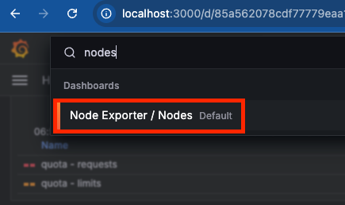
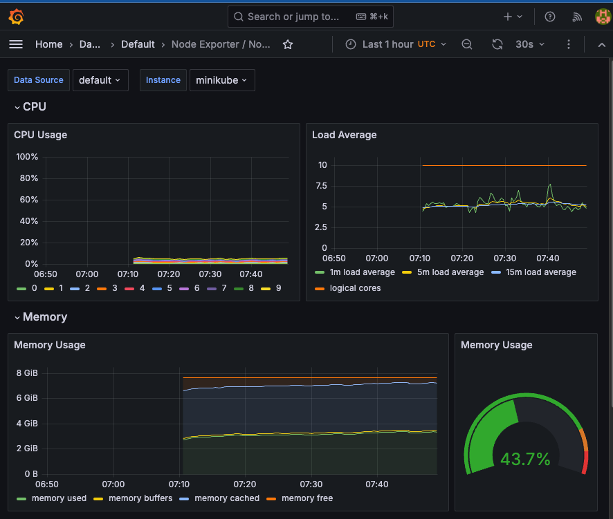

# Metriken und Dashboards mit Prometheus

In diesem Beispiel werden wir Prometheus in einen Minikube-Cluster installieren.
Zuerst legen wir dafür einen eigenen Namespace für Prometheus an. In diesem werden alle Workloads für Prometheus installiert.

## Schritt 1: Prometheus einrichten
Erstelle ein neues Namespace für Monitoring:

```shell
kubectl create namespace monitoring
```

Lade die Prometheus-Konfigurationsdateien herunter:

```shell
git clone https://github.com/prometheus-operator/kube-prometheus.git
cd kube-prometheus/manifests
```

Installiere die CRDs (Custom Resource Definitions) für Prometheus:
```shell
kubectl apply --server-side -f setup/
```

Installiere die Prometheus-Operator-Ressourcen:

```shell
kubectl apply -f .
```
Hinweis: Das kann einige Minuten dauern. Du kannst den Status der Deployments überwachen:

```shell
kubectl get deploy -n monitoring
NAME                  READY   UP-TO-DATE   AVAILABLE   AGE
blackbox-exporter     1/1     1            1           42m
grafana               1/1     1            1           42m
kube-state-metrics    1/1     1            1           42m
prometheus-adapter    2/2     2            2           42m
prometheus-operator   1/1     1            1           42m
```

Prometheus und Grafana sind fertig aufgesetzt, sobald alle Pods READY sind.

## Schritt 2: Prometheus mit Grafana abfragen

Sobald Prometheus und der Prometheus-Operator eingerichtet sind, wird Grafana bereits als Teil des Prometheus-Stacks mitinstalliert.
Um den Grafana-Dienst zugänglich zu machen, kannst du einen Port-Forward einrichten:

```shell
kubectl port-forward -n monitoring svc/grafana 3000:3000
```

Öffne deinen Webbrowser und gehe zu http://localhost:3000.

Die Standard-Anmeldedaten sind:
Benutzername: `admin`
Passwort: `admin`

Anschließend suchst du in der Suchleiste nach dem Dashboard mit dem Namen "Nodes" und öffnest es


Mit der Zeit wird sich das Dashboard mit Metriken füllen. Die Quelle dieser Metriken ist nicht der metrics-server, sondern Prometheus.
Der Scraper von Prometheus fragt in regelmäßigen Abständen das kubelet der Nodes nach aktuellen Metriken ab und speichert sie in der Datenbank.
Diese Daten können wir nun in Grafana sehen.

